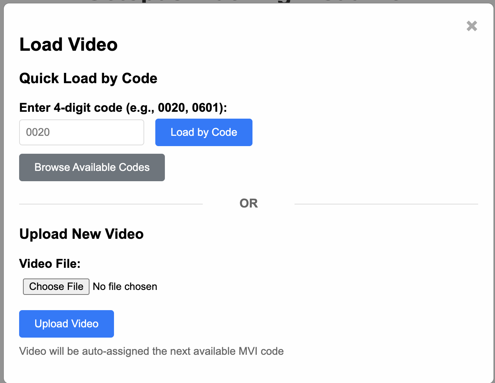
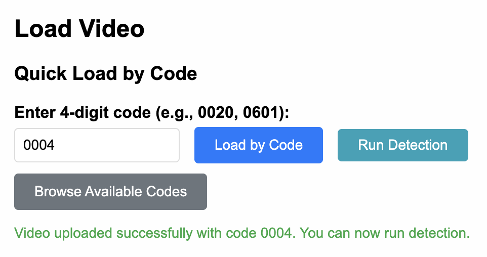
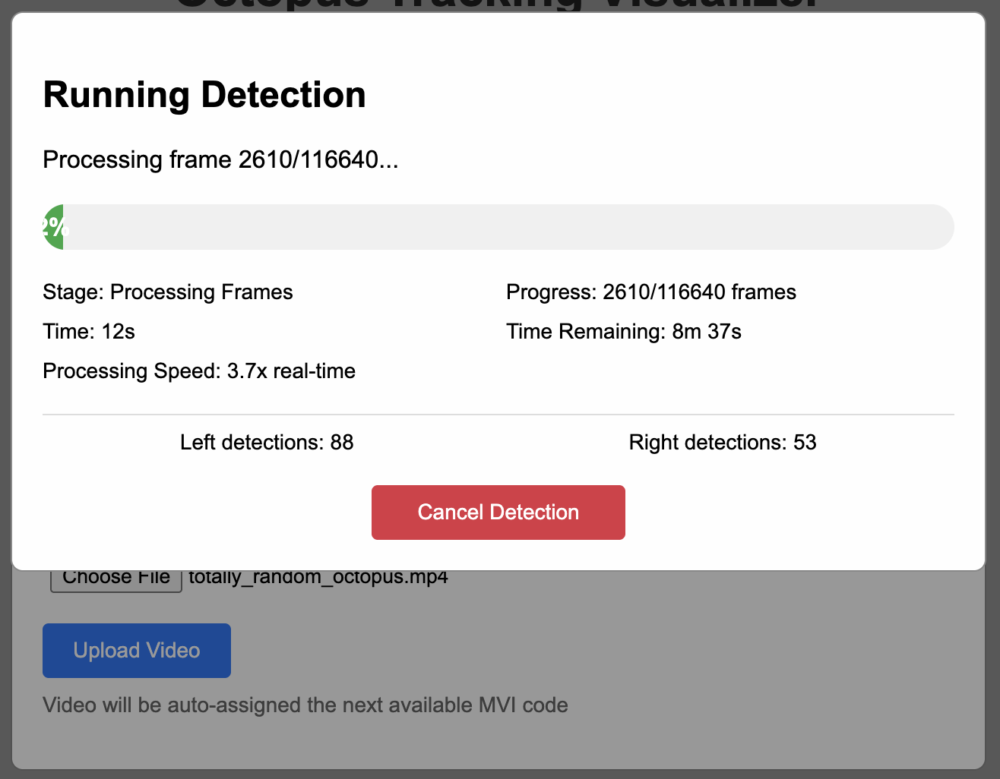
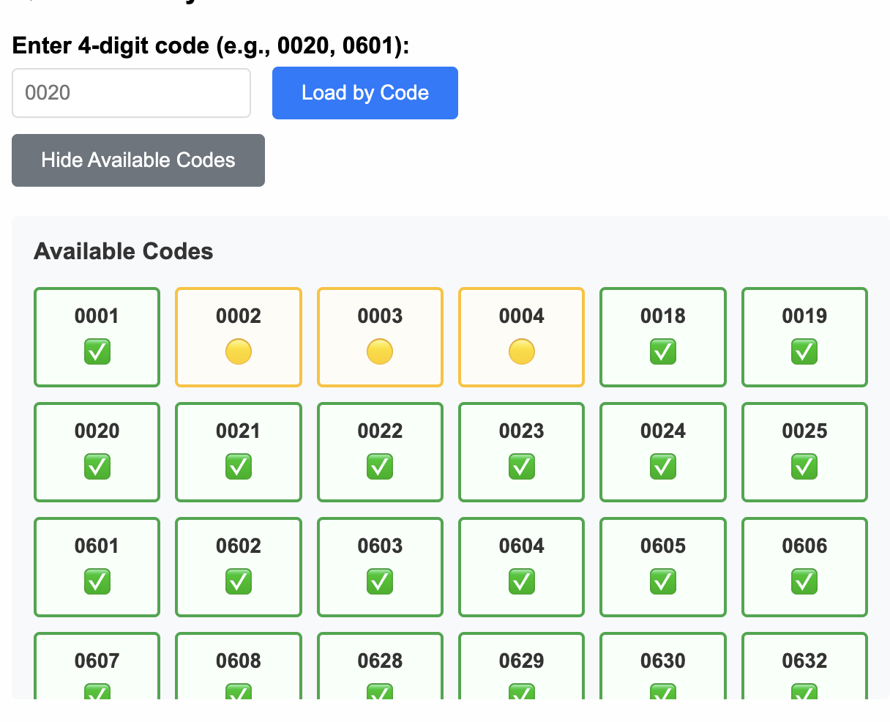
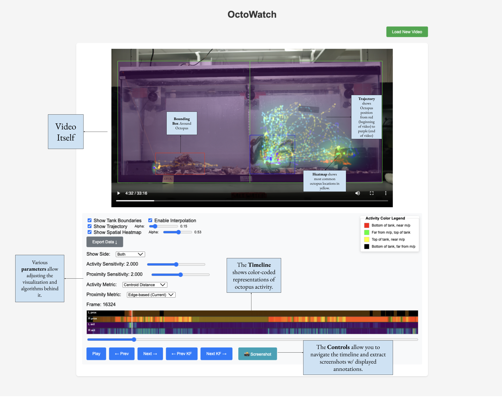
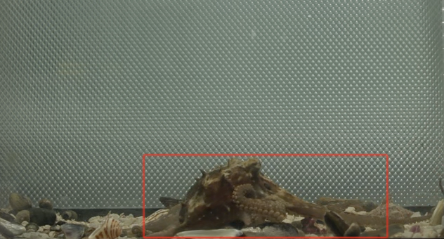
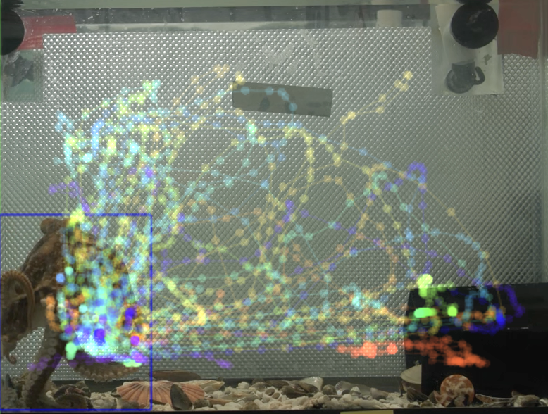
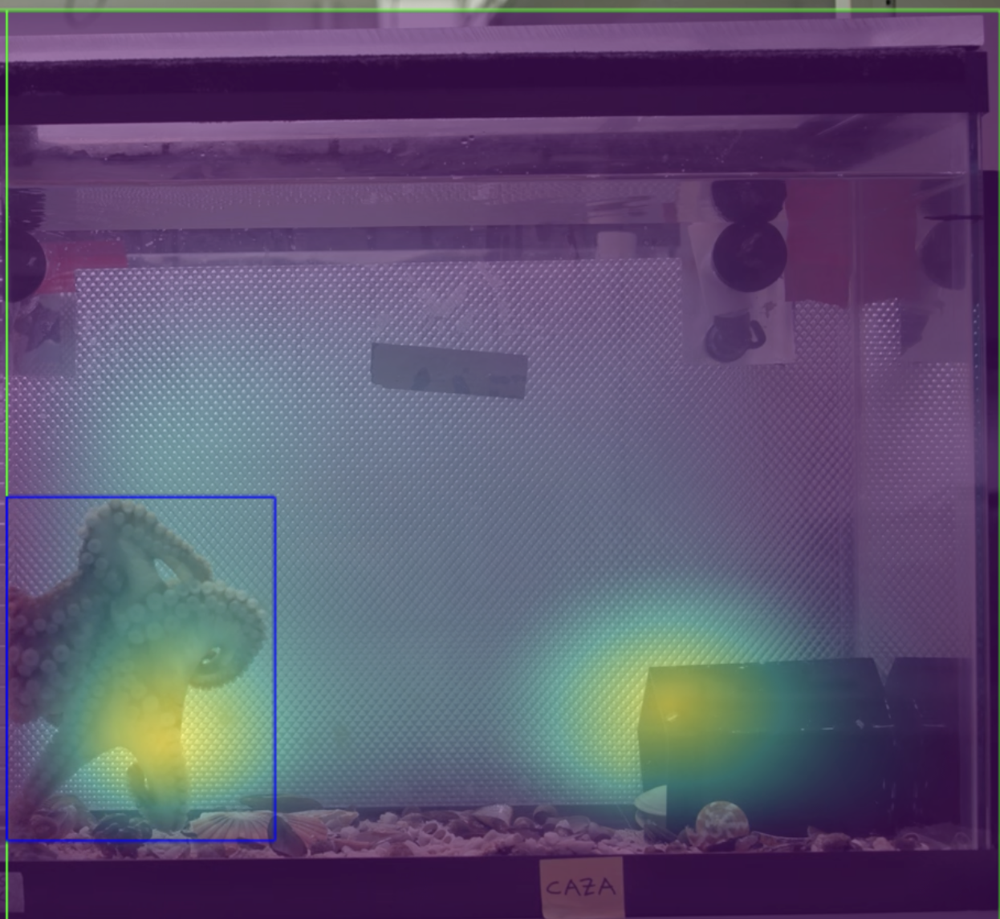
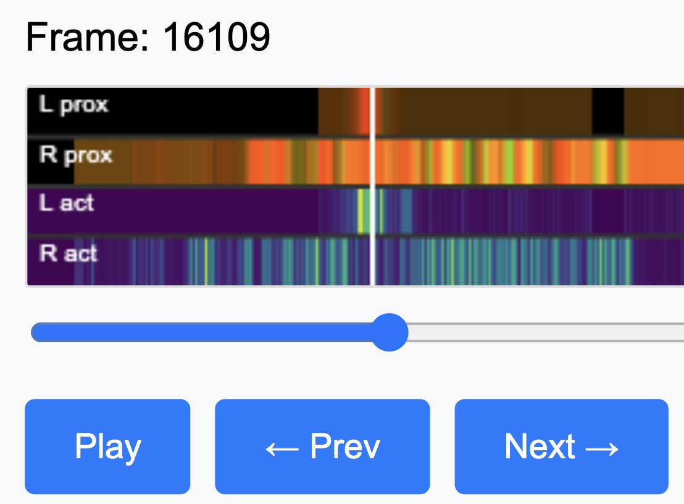

# OctoWatch

OctoWatch is a web application designed to track the locations of octopuses in a mirror-partitioned tank. It provides a user-friendly interface for researchers to monitor and analyze octopus movements. Below is a guide to help you get started with OctoWatch.

## System Requirements

OctoWatch runs on any modern computer - it uses the CPU by default, but will use a CUDA-compatible GPU or the GPU of an Apple Silicon Mac if available. It is recommended to have at least 16GB of RAM and a recent CPU/GPU for optimal performance. If a CPU *is* used, expect processing speeds of 1x (real-time) or slower. If a GPU is used, expect speeds of 2-4x real-time depending on the hardware.

## Loading & Detecting

When you first load OctoWatch, you will be presented with the following menu:

As no videos have been loaded yet, click the "Choose File" button to select a video file from your computer. The video file is expected to be in MP4 format. Once the video is selected, click "Upload Video" to save the video to OctoWatch's storage.

The video will be assigned an MVI code that is presently available (if one is not found in its title) - OctoWatch supports codes from 0001 to 9999. If all goes well, you should see something like this:

Clicking "Run Detection" will begin the detection process. A window will pop up showing the progress of the detection:

The detection typically runs at 2-4x real-time depending on your hardware - this means a 10-minute wait for a 30-minute video. Once the detection is complete, you will see a message indicating that the detection is finished and the video will load automatically. Detection consists of localizing the octopus in each frame using a bounding box and then post-processing the bounding boxes to produce a set of keyframes.

### Browsing Uploaded Videos

You can also look through previously uploaded videos by clicking the "Browse Available Codes" button on the initial menu. This will open the window below:

The green codes indicate videos that have already been processed, while the yellow codes indicate videos that are still pending detection. Clicking on a code will load the corresponding video into the "Enter a 4-digit code" field on the initial menu. It will also allow you to run detection on that video if it has not been processed yet, or re-run detection if it has.

You then can click "Load by Code" to load the video.

## Understanding the Analysis Interface

Once a video has been processed, you will be taken to the analysis interface (zoomed out here for illustration). Critical parts of the interface are labelled below:

Each part of the interface is described below:

### The Video Itself

The video is displayed at the top of the interface. You can play, pause, and scrub through the video using the controls below it. You can mute sound, adjust playback speed, etc. All visualizations are always overlaid on this player, and you can toggle them on and off using the checkboxes below. The overlays are rendered in real-time as you play the video, but lag behind slightly while scrubbing due to limitations of the HTML5 video player.

### The Visualizations

There are three visualizations available:

#### 1. Bounding Boxes

Bounding boxes are drawn around the octopus in each frame. The bounding box is the output of the detection model, and is used to compute the keyframes. The bounding box of the left octopus is drawn in red, while the right octopus is drawn in blue. If the octopus is not detected in a frame, no bounding box will be drawn. The bounding box at any given frame is computed by interpolating between the nearest keyframes.

#### 2. Trajectories

The trajectory of the octopus is computed by sparsely sampling the bounding box centers at each keyframe, and then interpolating between them. The result is a path that exists in three dimensions: X, Y, and Time. To show the temporal dimension, the trajectory is drawn in the colors of the rainbow, with red being the start of the video and purple being the end. Any given point on the trajectory corresponds to the position of the octopus at that time in the video. The trajectory is drawn as connected curve, with a dot at each keyframe.

#### 3. Heatmaps

Heatmaps are computed by tracking the box of the octopus over time and smoothly accumulating the time spent at each pixel. The heatmap is drawn as a semi-transparent overlay on top of the video, with yellow indicating areas where the octopus spent a lot of time, and blue-green indicating areas where the octopus spent less time, and purple indicating almost no time at all.

### The Timeline

The timeline is a crucial tool for monitoring octopus activity and finding potential interactions. It displays a slider & white line indicating the current frame (synced with the video player), as well as colored bars indicating octopus activity. A close-up those bars is shown below:

Here we see the 4 bars of the timeline - "L prox", "R prox", "L act", and "R act". The "L" and "R" indicate left and right octopuses, respectively. The "prox" bars indicate proximity to the mirror, and the "act" bars indicate activity level. 

#### Activity

Activity is fairly straightforward - it is computed as the difference in pixels between the two nearest keyframes, or the distance between the centroids. It uses the same colormap as the heatmap - purple indicates no activity, while yellow indicates high activity.

One can toggle the activity metric on and off using the "Activity Metric" dropdown. The default is "Centroid-Based", which computes activity based on the distance between the centroids of the bounding boxes at each keyframe. The other option is "Box-Based", which computes activity based on the pixel difference between the bounding boxes at each keyframe.

The sensitivity of the activity metric can be adjusted using the "Activity Sensitivity" slider. A higher sensitivity exposes more of the range of activity, while a lower sensitivity suppresses it.

#### Proximity

Proximity is slightly more complicated - it varies along two color channels, red and green. Red represents proximity to the mirror, while green represents proximity to the top of the tank. This means that black indicates the octopus is far from both the mirror and at the bottom, red indicates the octopus is close to the mirror at the bottom, green indicates the octopus at the top of the tank away from the mirror, and yellow indicates the octopus close to the mirror at the top of the tank. 

This lets one quickly spot things such as "the octopus approaching the mirror from the bottom" (red ramping up) or "the octopus retreating from the mirror at the top of the tank" (yellow ramping down to green). It's most powerful application, however, is the ability to intuitively observe when both octopuses are close to the mirror. This can be seen when both bars are red-yellow at the same time, which is a strong indicator of potential interaction. The image above provides an example of this.

The proximity metric can be adjusted using the "Proximity Metric" dropdown. The default is "Box-Based", which computes proximity based on the distance of the bounding box to the mirror edge. The other option is "Centroid-Based", which computes proximity based on the distance of the bounding box centroid to the mirror edge. 

The sensitivity of the proximity metric can also be adjusted using the "Proximity Sensitivity" slider.

## Exporting Data

You can always find the raw keyframes in the directory `videos_keyframes/MVI_XXXX_keyframes.json` where `XXXX` is the 4-digit MVI code of the video. This directory will appear in the same path that you run the `app.py` script from.

If you wish to export the analysis performed by the application,you can click the "Export Data" and select what sort of data you wish to export. You can export the trajectory, activity, proximity as CSV or JSON, and download the heatmaps as images as well. You can also export all data at once using the "Export All" button - which will write it all into a JSON file.

